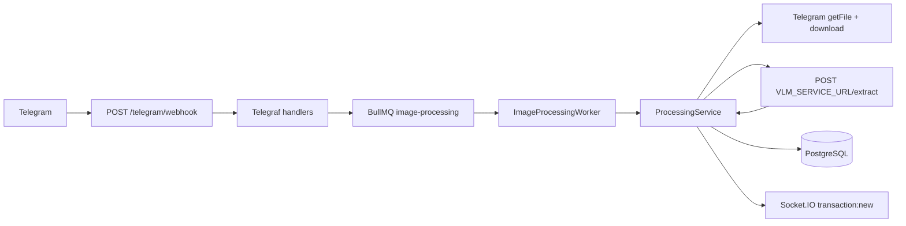

# Data flow and application wiring

This document describes how the Birr Track backend is composed at runtime and how a receipt image moves from Telegram ingestion through VLM extraction, persistence, and real-time notification.

## High-level architecture

| Component | Role |
|-----------|------|
| **NestJS API** (`birr-track-backend`) | Telegram webhook handling, BullMQ jobs, HTTP client to the VLM service, transactions API, Socket.IO |
| **VLM service** (external Python service, not yet implemented) | Hosts a fine-tuned Qwen2.5-VL-3B; exposes `POST /extract` returning structured transaction fields |
| **Redis** | BullMQ queue backend for asynchronous image jobs |
| **PostgreSQL** | TypeORM persistence for transactions and related data |

The Nest app wires modules in `AppModule`: configuration, throttling, TypeORM, `TelegramModule`, `QueueModule`, `ProcessingModule`, `TransactionsModule`, `BusinessesModule`, and `WebsocketModule`.

## Module dependencies (NestJS)

- **TelegramModule** registers the Telegraf bot (token from `TELEGRAM_BOT_TOKEN`), imports **QueueModule**, and exposes `POST /telegram/webhook/:secret`. Updates are passed to Telegraf; photo handlers enqueue work instead of processing inline.
- **QueueModule** owns **QueueService** (producers) and **ImageProcessingWorker** (consumer). It imports **ProcessingModule** so the worker can call **ProcessingService**.
- **ProcessingModule** provides **VlmService** and **ProcessingService**, and imports **TransactionsModule** and **WebsocketModule** for saves and emits.

Cross-cutting: global exception filter, context-aware throttler guard, and Winston-style logging as configured in the app.

## End-to-end path: one receipt image

### 1. Ingress (Telegram)

1. Telegram delivers an update to `POST /telegram/webhook/:secret` (optional `TELEGRAM_WEBHOOK_SECRET` check).
2. **TelegramController** forwards the update to the Telegraf instance.
3. **TelegramUpdateHandler** handles `photo` events via **TelegramService.handlePhotoMessage**.
4. The largest photo variant is chosen (by pixel area). The job payload is minimal: `telegramUserId`, `telegramName` (from Telegram profile), and Telegram `fileId` — not the image bytes yet.

### 2. Queue (asynchronous boundary)

5. **QueueService** adds a BullMQ job named `process-image` on the queue `image-processing`, with Redis connection from `REDIS_HOST` / `REDIS_PORT` (defaults: `127.0.0.1`, `6379`). Jobs use retries with exponential backoff.
6. **ImageProcessingWorker** runs with concurrency `2` and invokes **ProcessingService.processImageJob** for each job payload.

### 3. Resolve and download the file (NestJS)

7. **ProcessingService** calls Telegram `getFile` with `TELEGRAM_BOT_TOKEN` and builds a direct download URL: `https://api.telegram.org/file/bot<token>/<file_path>`.
8. The image is downloaded with HTTP (axios) into a `Buffer`. That same URL is later stored as `imageUrl` on the transaction when a row is created.

### 4. VLM extraction (NestJS → VLM service)

9. **VlmService** POSTs multipart form data to `{VLM_SERVICE_URL}/extract` with the image (field `file`, filename `receipt.jpg`, content type `image/jpeg`). `VLM_SERVICE_URL` must be set.
10. The VLM service returns a JSON body containing structured transaction fields:

    ```json
    {
      "bankName": "Commercial Bank of Ethiopia",
      "amount": 5000.00,
      "transactionId": "FT26133277TZ",
      "timestamp": "2026-05-13T00:00:00.000Z",
      "currency": "ETB",
      "confidence": 0.93
    }
    ```

11. **VlmService.normalizeResponse** coerces amount strings to numbers, trims empty strings to `null`, and clamps confidence to a finite number.

### 5. Persistence and real-time fan-out (final stage)

12. If **any** of `amount`, `transactionId`, `timestamp`, or `bankName` is `null` after VLM extraction, **ProcessingService** logs a warning and **returns without saving** — no database row and no WebSocket event.
13. Otherwise **TransactionsService.findDuplicate** looks up an existing row matching `transactionId`, `amount` (two decimal places), and `timestamp`.
14. **TransactionsService.create** inserts a **Transaction** with `isDuplicate` set from step 13, `confidence` from the VLM response, and `imageUrl` set to the Telegram file URL from step 8.
15. **TransactionEventsGateway** emits a Socket.IO event `transaction:new` to all connected clients with the created transaction (amount normalized to a number in the payload).

## Configuration summary

| Variable | Used for |
|----------|----------|
| `TELEGRAM_BOT_TOKEN` | Bot auth, `getFile`, file URLs |
| `TELEGRAM_WEBHOOK_SECRET` | Optional path secret for webhook |
| `REDIS_HOST`, `REDIS_PORT` | BullMQ |
| `VLM_SERVICE_URL` | Base URL for `POST /extract` |

The VLM Python inference service is not yet implemented. Until it is, the worker will fail at runtime on every receipt; the error message is loud and points back to `VLM_SERVICE_URL`.

## Diagram (conceptual)



## Related code (entry points)

- Nest bootstrap and module graph: `birr-track-backend/src/app.module.ts`
- Webhook and photo enqueue: `birr-track-backend/src/telegram/telegram.controller.ts`, `telegram.update.ts`, `telegram.service.ts`
- Queue and worker: `birr-track-backend/src/queue/queue.service.ts`, `image-processing.worker.ts`
- Pipeline orchestration: `birr-track-backend/src/processing/processing.service.ts`
- VLM HTTP client: `birr-track-backend/src/processing/vlm.service.ts`
- Training scaffold for the VLM model: `qwen-vlm-training/`

---

*Generated from the repository implementation. If behavior changes, update this file alongside the code.*
